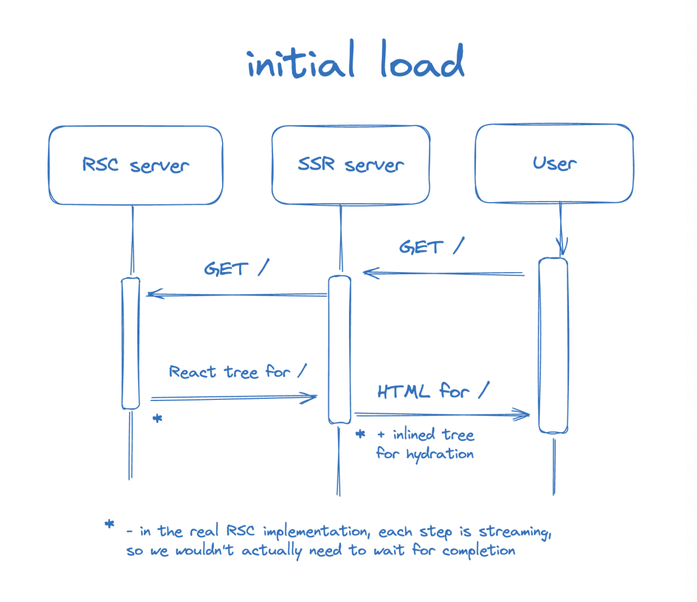
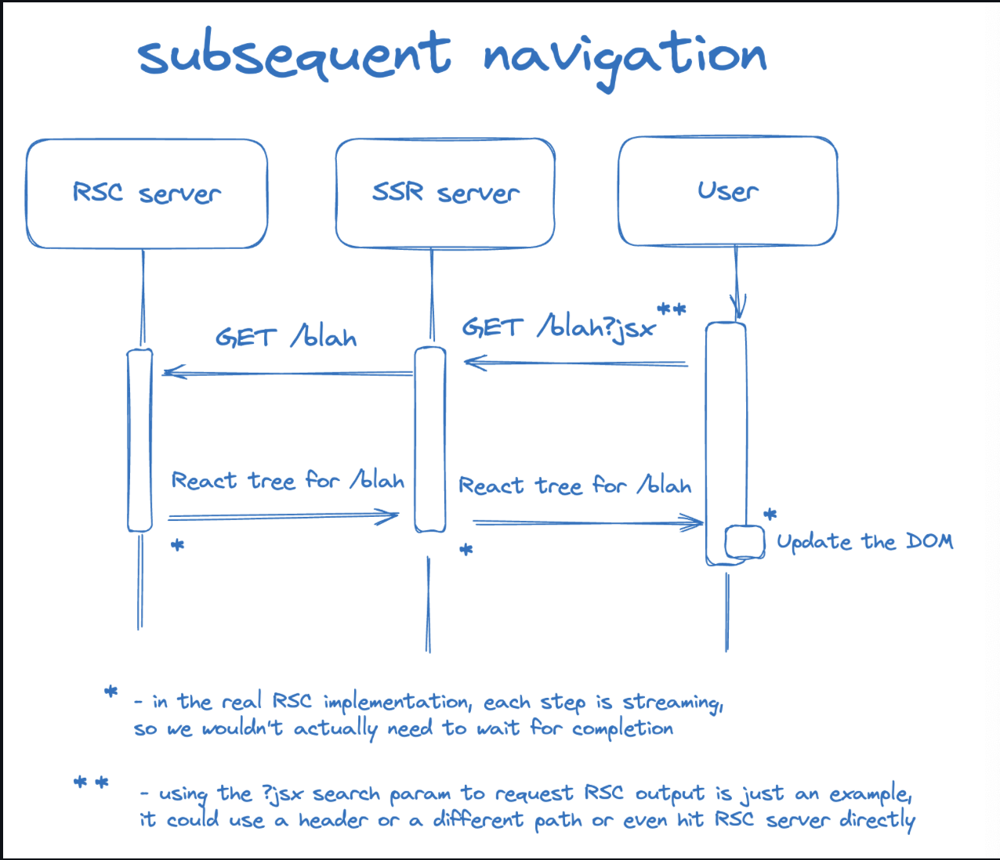

# what is RSC

This repo is a copy of the code explained in [this article](https://github.com/reactwg/server-components/discussions/5) from [dan](https://github.com/gaearon), and you can read the explaination and source code from the article. Making this copy just for self learning and make some notes

## usage

To run this example:

- `npm install` or `yarn`
- `npm run dev` or `yarn dev`

## short note

Considering RSC server and SSR server as two seperated server and maybe hosted on different machines, RSC server just serve JSX, and SSR server is managed to serve HTML or just forward JSX to client.

The initial load request from client sent to SSR server, and then SSR server send request to RSC server. RSC server handle request from SSR server and response with client JSX if everthing is fine. SSR server receive client JSX which only has client built-in HTML tag like `a`, `div` and so on, and render it as HTML string, along with some client script which will be used for subsequent navigation, sending to client.

If we want to preserve client loacl state, subsequent navigation like click a link should not behave like initial load. Because sending a totaly html page to client will lost local state. So the client script which sent to client at initial load will intercept brwoser default navigation behaviour, and overide with self-defined navigat function. SSR server will send react tree to client, and the client react is managed how to diff the tree and update UI.

## reference

pictures and code from:
1. [RSC From Scratch. Part 1: Server Components](https://github.com/reactwg/server-components/discussions/5)
